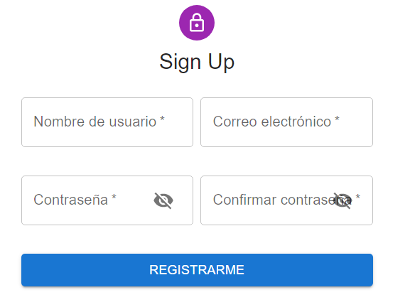
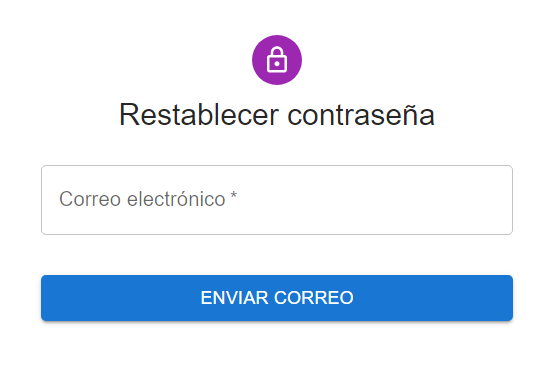
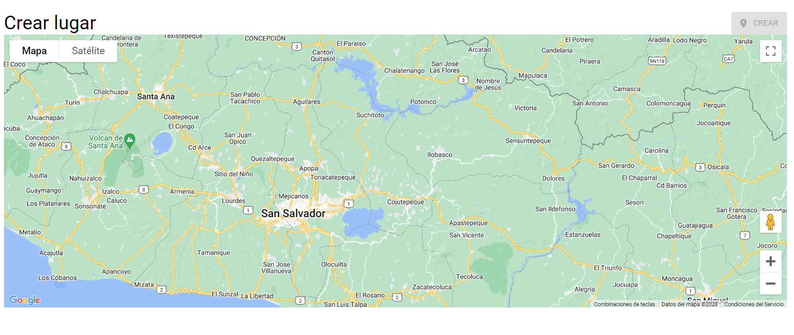
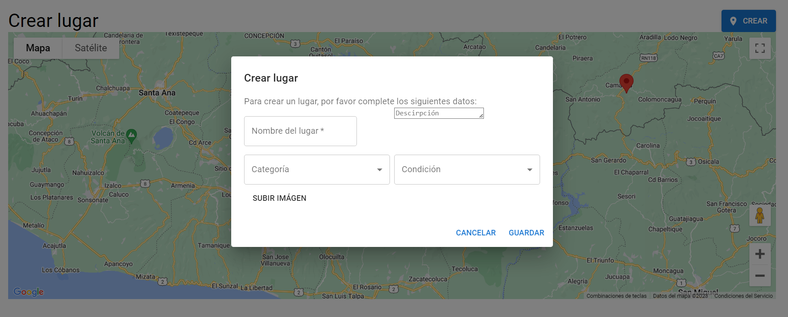
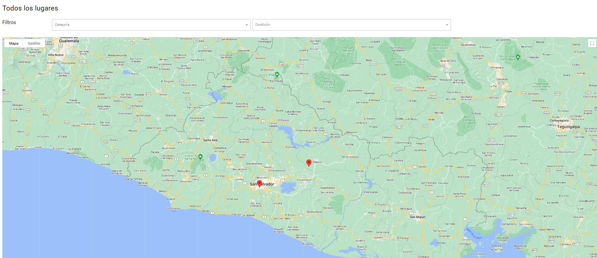
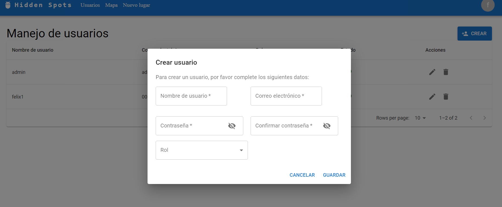
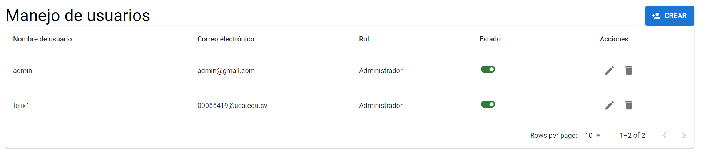

# Manual De Usuario Hidden Spots
## **Integrantes**
<ul>
  <li>Felix Gerardo Guevara Palacios</li>
  <li>Oscar Alejandro Rodriguez Abrego</li>
  <li>Oscar Agustín Recinos Alvarenga</li>
  <li>Ivette Carolina Pinto Leon</li>
</ul> 

# Usuario normal
## ¿Como crear una cuenta en Hidden Spots?
En la pantalla de inicio selecciona la opción registrate aquí, accediendo al siguiente formulario

Posteriormente se mostrará un botón que lo redirigirá a la pantalla inicial donde podrá iniciar sesión.

## ¿Como puedo recuperar mi contraseña?

En la pantalla inicial se debe seleccionar la opción ¿Olvidaste tu contraseña?, será redirigido a la siguiente pantalla y posterior a ingresar el correo electrónico recibirá indicaciones en un correo electrónico.

## ¿Como crear un Hidden Spot?
Despues de iniciar sesión se selecciona un punto en el mapa

 posterior a eso se habilitará el botón crear desplegando el siguiente formulario al presionarlo.
 

# Usuario administrador

## ¿Como buscar un HiddenSpot?
Al iniciar sesión como administrador el sistema brinda filtros para buscar los hiddenspots agregados.

## ¿Como se agrega un usuario? 

Posterior a iniciar se debe seleccionar la opción usuarios en el menú principal, seleccionar la opción crear de la pantalla principal de gestión de usuarios y se debe ingresar la información solicitada

## ¿Es posible editar o eliminar usuarios?

En la pantalla principal de usuarios se puede editar o eliminar la información de los usuarios.

